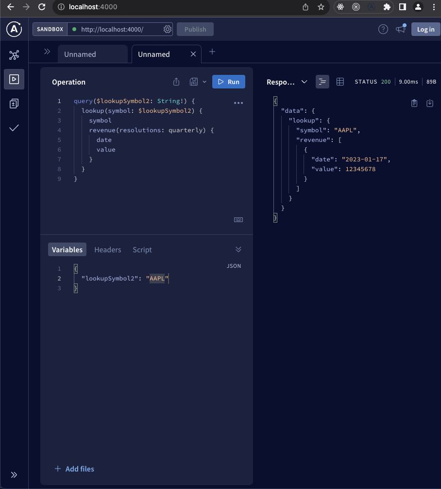
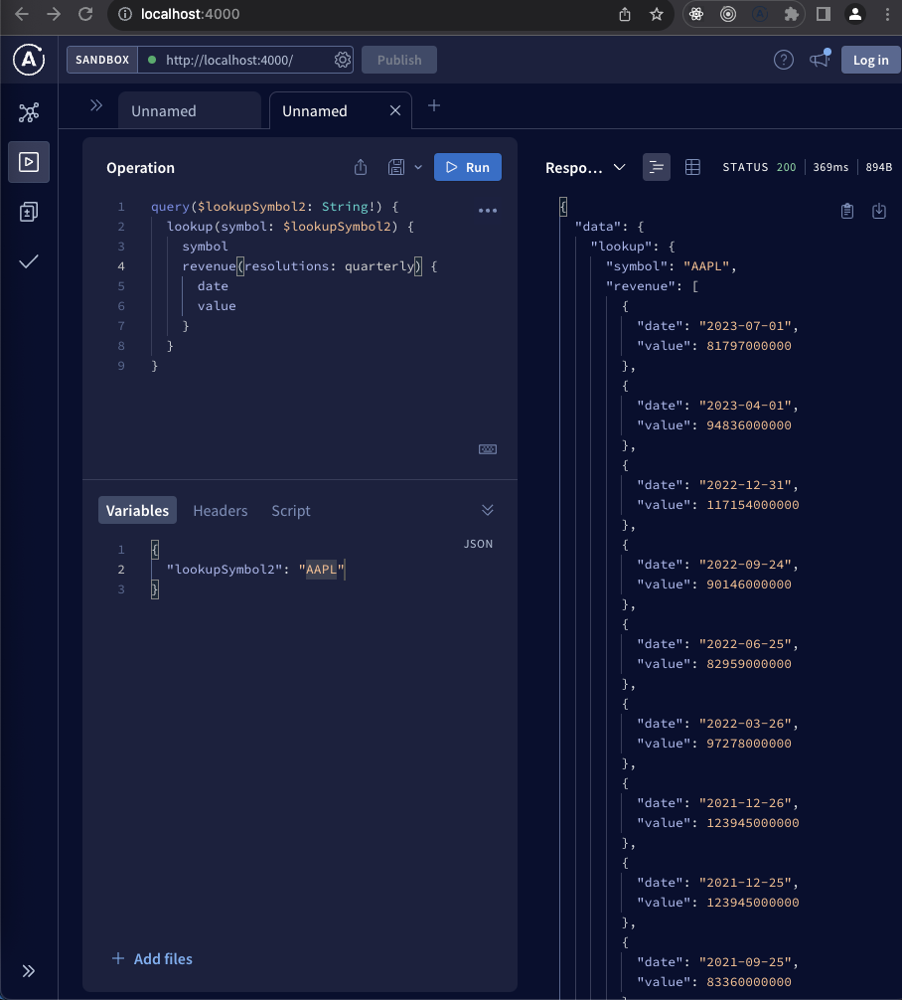
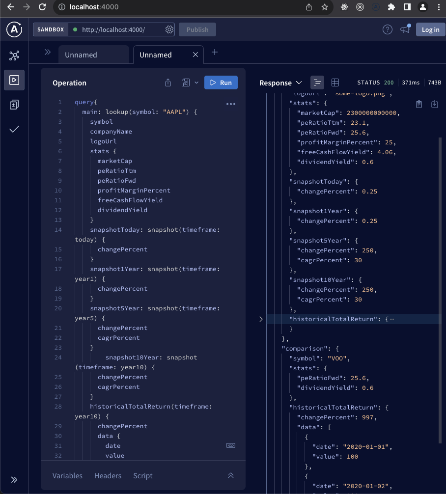

## quote-checker backend

It is an app consuming iexjs cloud api for historical price/performance of a ticker(stock, quote, crypto). It is based on apollo graphQL to provide this functionality while also serving the frontend at [quote-checker-fe](https://github.com/codeForMobile/quote-checker-fe)

Few custom types have been built to serve the ui although not all api's are yet consumed in ui.

### How to install

`npm install`

### How to run

`npm run dev` and open
`http://localhost:4000/`

### How does it look

Basic api wrapper

Basic api wrapper with dummy revenue data

Api with real revenue data

Final api to compare revenue of 2 products, in this case `AAPL` and etf `VOO`

